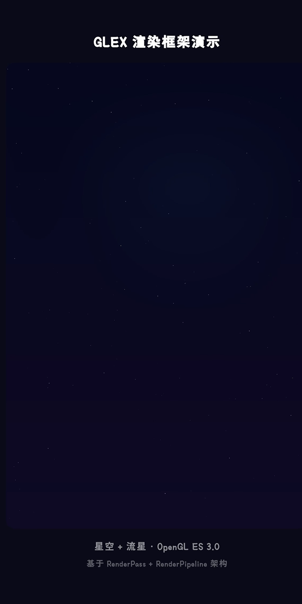

# GLEX - 鸿蒙生态首个开源 OpenGL ES 渲染框架

<div align="center">

**🎯 HarmonyOS 生态首个开源的原生 OpenGL 渲染框架**

[](LICENSE)
[](https://developer.huawei.com/consumer/cn/harmonyos/)
[](https://www.khronos.org/opengles/)

[English](README_EN.md) | 简体中文

</div>

## 为什么需要 GLEX？

在 HarmonyOS 生态中，开发者面临着这些痛点：

- ❌ **EGL 初始化繁琐** — 需要手写数百行样板代码处理 EGL 配置、上下文创建、Surface 绑定
- ❌ **XComponent 集成复杂** — NAPI 桥接、生命周期管理、线程同步，门槛极高
- ❌ **缺少渲染抽象** — 每个项目都要重复造轮子，没有统一的 Shader 管理和渲染管线
- ❌ **没有参考实现** — 社区缺少完整的、可直接使用的 OpenGL 框架

**GLEX 是鸿蒙生态首个解决这些问题的开源框架。**

## 核心价值

### 🚀 开箱即用的 ArkTS 组件

```typescript
import { GLEXComponent } from '@yunshen1933/ohos_glex';

@Entry
@Component
struct MyPage {
  build() {
    GLEXComponent({ targetFPS: 60 })
      .width('100%')
      .height(400)
  }
}
```

**3 行代码，启动 60 FPS 的 OpenGL 渲染。** 无需了解 EGL、NAPI、XComponent 的任何细节。

### 🏗️ 工业级架构设计

GLEX 不是简单的 Demo，而是经过精心设计的生产级框架：

- **分层清晰** — EGL 管理 → Shader 工具 → 渲染管线 → ArkTS 组件，每层职责明确
- **线程安全** — 独立渲染线程，自动处理 GL 上下文切换和同步
- **可扩展性** — RenderPass 抽象基类，支持多阶段渲染管线编排
- **容错机制** — ES 3.2 → 3.0 → 2.0 自动降级，兼容不同设备能力

### 💎 完整的 C++ 实现

```cpp
class MyCustomPass : public glex::RenderPass {
protected:
    void onInitialize(int width, int height) override {
        shader_.build(vertexSrc, fragmentSrc);
    }

    void onRender() override {
        shader_.use();
        shader_.setUniform1f("u_time", time_);
        // 你的渲染逻辑
    }
};
```

提供完整的 C++ 源码，包括：
- `GLContext` — EGL 上下文管理
- `ShaderProgram` — 着色器编译与 Uniform 缓存
- `RenderPass` / `RenderPipeline` — 渲染管线抽象
- `RenderThread` — 独立渲染线程与帧率控制

### 🎨 内置演示效果



**200 颗闪烁星星 + 流星拖尾动画**，全部由 OpenGL ES 3.0 Shader 实时渲染，展示框架的实际能力。

## 技术亮点

| 特性 | 说明 |
|------|------|
| **零依赖** | 仅依赖 HarmonyOS 系统库，无第三方依赖 |
| **高性能** | 独立渲染线程，稳定 60 FPS，实时 FPS 统计 |
| **自动化** | XComponent 生命周期全自动管理，无需手动处理 |
| **类型安全** | 完整的 TypeScript 类型声明 |
| **现代 C++** | C++17 标准，RAII 资源管理，智能指针 |
| **跨架构** | 支持 arm64-v8a 和 x86_64 |

## 快速开始

### 安装

```bash
ohpm install @yunshen1933/ohos_glex
```

### 基础使用

```typescript
import { GLEXComponent, GLInfo } from '@yunshen1933/ohos_glex';

@Entry
@Component
struct DemoPage {
  build() {
    Column() {
      GLEXComponent({
        targetFPS: 60,
        clearColor: [0.02, 0.03, 0.10, 1.0],
        autoStart: true,
        onReady: () => {
          console.info('OpenGL 渲染已启动');
        }
      })
        .width('100%')
        .height('100%')
    }
  }
}
```

### 获取运行时信息

```typescript
private glexRef: GLEXComponent | null = null;

GLEXComponent({
  targetFPS: 60,
  onReady: () => {
    const fps = this.glexRef?.getCurrentFPS();
    const info: GLInfo | undefined = this.glexRef?.getGLInfo();
    console.info(`FPS: ${fps}, GPU: ${info?.renderer}`);
  }
})
```

## 架构设计

```
┌─────────────────────────────────────────┐
│  ArkTS Layer (GLEXComponent)            │  ← 声明式 UI 组件
├─��───────────────────────────────────────┤
│  NAPI Bridge                             │  ← JS ↔ Native 桥接
├─────────────────────────────────────────┤
│  RenderThread (独立线程)                 │  ← 帧率控制 + FPS 统计
├─────────────────────────────────────────┤
│  RenderPipeline                          │  ← 多阶段渲染管线
│  ┌──────────┬──────────┬──────────┐     │
│  │ Pass 1   │ Pass 2   │ Pass N   │     │  ← 可扩展的渲染阶段
│  └──────────┴──────────┴──────────┘     │
├─────────────────────────────────────────┤
│  GLContext │ ShaderProgram              │  ← 核心工具类
├─────────────────────────────────────────┤
│  EGL / OpenGL ES 3.x                    │  ← 系统 API
└─────────────────────────────────────────┘
```

## 适用场景

- ✅ **游戏引擎** — 2D/3D 游戏渲染
- ✅ **数据可视化** — 大规模粒子系统、实时图表
- ✅ **图像处理** — GPU 加速的滤镜、特效
- ✅ **AR/VR** — 沉浸式体验
- ✅ **创意应用** — 音乐可视化、生成艺术

## 文档

- [完整 API 文档](library/README.md)
- [环境配置指南](SETUP.md)
- [示例代码](entry/src/main/ets/pages/Index.ets)

## 系统要求

- **开发环境**: DevEco Studio 5.0.0+
- **HarmonyOS SDK**: API 12 (6.0.2)+
- **设备要求**: 支持 OpenGL ES 3.0+
- **支持设备**: phone、tablet、2in1
- **ABI 架构**: arm64-v8a、x86_64

## 贡献

欢迎提交 Issue 和 Pull Request！

## 开源协议

本项目基于 [Apache License 2.0](LICENSE) 开源。

## 作者

**云深** - 鸿蒙生态开发者

---

<div align="center">

**如果这个项目对你有帮助，请给一个 ⭐️ Star！**

这是鸿蒙生态首个开源的 OpenGL 框架，你的支持是持续维护的动力。

</div>
